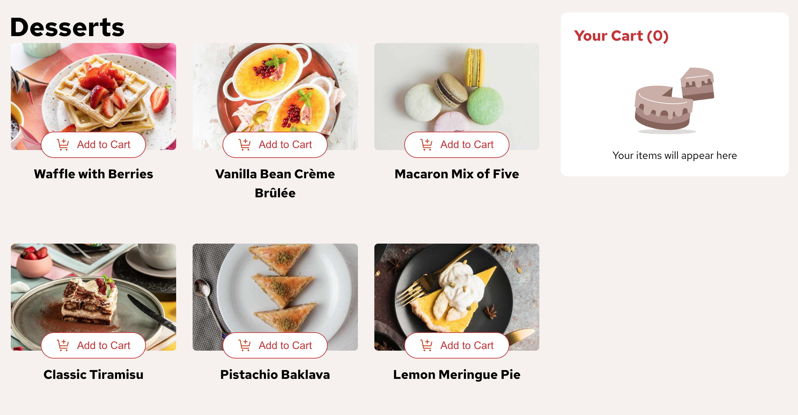
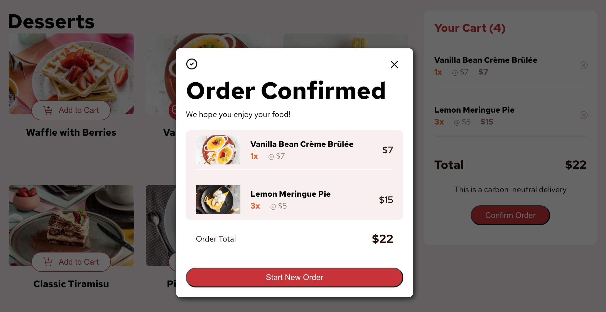
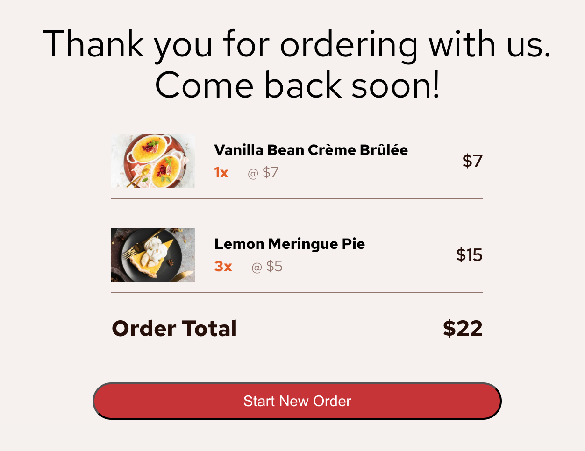

# Frontend Mentor - Product list with cart solution

This is a solution to the [Product list with cart challenge on Frontend Mentor](https://www.frontendmentor.io/challenges/product-list-with-cart-5MmqLVAp_d). Frontend Mentor challenges help you improve your coding skills by building realistic projects.

## Table of contents

- [Overview](#overview)
  - [The challenge](#the-challenge)
  - [Screenshots](#screenshot)
  - [Links](#links)
  - [Built with](#built-with)
  - [What I learned](#what-i-learned)
  - [Continued development](#continued-development)
  - [Useful resources](#useful-resources)
- [Author](#author)

## Overview

This was one of my first projects built with React. I also used an unstyled component library, useContext, useEffect, and React Router all for the first time.

### The challenge

Users should be able to:

- Add items to the cart and remove them
- Increase/decrease the number of items in the cart
- See an order confirmation modal when they click "Confirm Order"
- Reset their selections when they click "Start New Order"
- View the optimal layout for the interface depending on their device's screen size
- See hover and focus states for all interactive elements on the page

### Screenshots

### Links

- Live Site URL: [Just Desserts](https://just-desserts-fem.netlify.app/)

### Built with

- [React](https://reactjs.org/)
- [React Router](https://reactrouter.com/)
- [Headless UI](https://headlessui.com/react/dialog) - for the modal only

### What I learned

I learned a lot about breaking a website up into to components and how to manage state across those components.

### Continued Development

I hope to build many more projects with React and improve my architecture, accessibility, clean code practices. I plan to learn SCSS and Tailwind and try those in some projects.

### Useful resources

- [React Router Tutorial](https://www.youtube.com/watch?v=oTIJunBa6MA) - This helped me get React Router set up. I also used the docs to figure out how to use the useNavigation hook.
- [Why you shouldn't pass state as a prop](https://medium.com/@christopherthai/why-you-shouldnt-pass-react-s-setstate-as-a-prop-a-deep-dive-8a3dcd74bec8) - I started this project before learning useContext so this helped me understand why passing state and state setters as props is not a best practice.

## Author

- Website - [Visual Fraction Library](www.visualfractionlibrary.com) - I don't have a portfolio yet but this is my first portfolio project built in Vanilla JS.
- Frontend Mentor - [@mathematiCode](https://www.frontendmentor.io/profile/mathematiCode)
- BlueSky - [@math-coder](https://bsky.app/profile/mathcoder.bsky.social)
